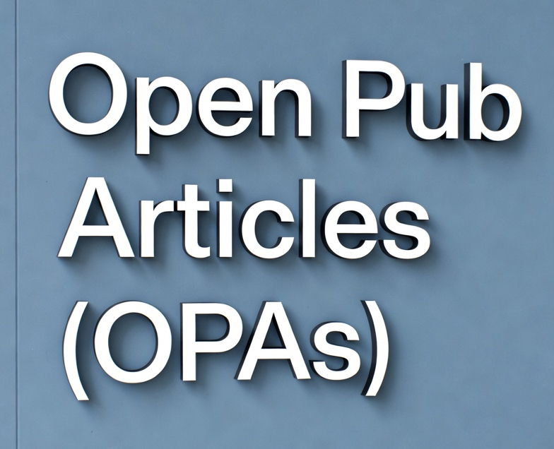

# Open Pub Articles (OPAs)

Open Pub Articles (OPAs): https://opas.pubpub.org

# OPAs 

---

Publications/Yayınlar:

1. Keçeci, M. (2026). Nodal-Line Yarımetalleri: Kuantum Bilişiminde Geometrik Bir Avantaj. Open Pub Articles (OPAs).  https://doi.org/10.21428/aaf7bfa8.7cda9748, https://opas.pubpub.org/pub/lqhxrioo

1. Keçeci, M. (2026). Majorana Fermiyonlarından Kuantum Cihazlarına: İkinci Kuantum Çağında Nanomalzemelerin Rolü. Open Pub Articles (OPAs). https://doi.org/10.21428/aaf7bfa8.215373ff, https://opas.pubpub.org/pub/odgdo83p
